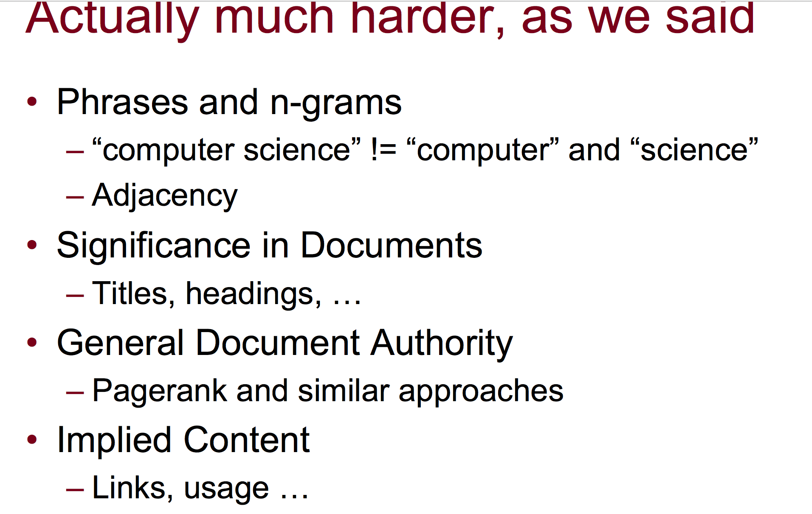

# Lecture 3 Content-Based Recommenders #

Systems in this lecture:

* Pure info filtering 
* Case-based reasoning
* Knowledge-based navigation 
---
## Stable Preferences ##

* Model items according to relevant attributes - knowledge enginereing or human efforts.
* Model or reveal preferences by attributes
## Content-Based ##

	Building a vector of attributes
	Example: Krakatoa Chronicle
	
How user build its own profiles?

* Ask user to create it. - awkward and sometimes people could not recognized.
* Infer profile from actions : **click, buy, read** - Learn from data implicitly.
* Explicit user rating 
* Merge two together. 

How to build preferences?

* Set a set of "keywords", or even a phrase. 
* Count

Problem: If given a vector of keyword prefernces.

* Do we just add up likes and dislikes?
* Can we figure out which are more and less relevant

The assignment is Content-Based Recommenders

---
Structure a database of cases around a set of relevant attributes (e.g., camera prices, zoom, pixel.) -Cased-based reasoning a subject in Machine Learning. 

**The example: etown's Ask Ida. The key idea is:**

* Uses an interview process to elicit preferences over attributes in a cased-based approach. ( How are you going to use your camera, email to friends, make prints?) , and explain why they are asking. 
* Uses preferences to recommend.
* Uses recommends to further elicit preferences.  
* **Not use to be a permanent preferences, just for transactional purposes.**

**Another example: Entree results **

* First it ask the place you familiar with, and which restaurant would you choose.
* Then it recommend a restaurant in the place you are.
* Then it has several buttons, to show further preferences: 
	* Less money
	* More creating
	* Quite... etc...
* By showing similar properties, and asking more questions until you find the one you like.

	Case-based recommendations are often easier to explain to ther user.
	
Challenges and Drawbacks:

* Require a well-structure attributes that align with the preferences.
* Depends on having a reasonable distribution of attributes across items
* Not able to find surprising connections. which is more happening in collaborative filtering.
* Harder to find complements than substitutes. Similar as above.

Good news:

* Work without a large set of users.
* Good at finding substitutes but need more data.
* Good explainability.

## Term Frequency Inverse Document Frequency -TFIDF ##

A magical weighting function. To know how it is use in both search and filtering. 

Motivations:

* Why primitive search engines fail? A lot of unrefined documents are returned. 
* How often the term really occurred in the document you are thinking of.
* Not all terms are equally important.

Definitions: 

* **Term Frequency** - # of number of occurrences of a term in the document- could be a simple count.
* **Inverse Document Frequency** - how rare it is for a document to have this term. 
	*  $$\log (\frac{documents} {documents with term})$$
	*  We don't care if term is frequently everywhere, instead, we care about terms that occurs rare.
Case it fails:

* The core term isn't actually used much in document.
* Ask for bad terms. Causes poor search.

How does it apply to CBF:

* To generate a profile of a document. The movies could be described as a *weighted *vector of the tags.
* Combine with rating to create profiles, and matched against future documents.

### Hardness in TFIDF ###

---

